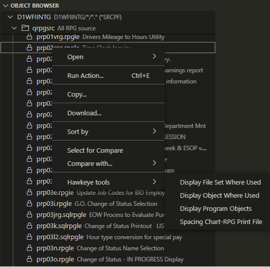
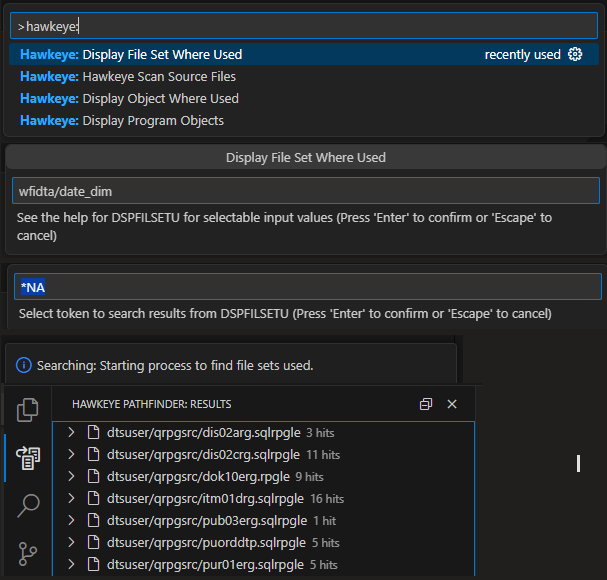

# vscode-ibmi-hawkeye

This extension provides functionality for the source cross reference tool Hawkeye Pathfinder.

## Features of note
* It has its own Activity Bar and search results. Several methods of activating cross reference commands.  
* Currently, if cross reference does not correspond to source member then results are not shown. 
* Hawkeye Pathfinder command interface through standard VS Code prompts or Code for IBM i action prompts.  
* Configuration option to choose between using standard VS Code prompts or Code for IBM i actions.
* Keep all your search results for the life of the VS Code session, or until you choose to dismiss them.
* Perform additional Hawkeye Pathfinder commands on search result items. 

## Hawkeye Pathfinder commands utilized:

* DSPFILSETU  - Display file sets used
* DSPSCNSRC - Display scanned source
* DSPOBJU - Display Object Usage
* DSPPGMOBJ - Display Program Objects
* DSPPRCU - Display Procedure Usage
* PRTRPGPRT - Spacing Charts - Print Files in RPG
* PRTDDSPRT - Spacing Charts - Print Files in DDS
* PRTDDSDSP - Spacing Charts - Display Files in DDS

## PICS
* Start up view
* Once connected
* Running commands from Hawkeye Activity Bar view
* Running commands from command palette
* Running commands from Code for IBM i object browser
* Running commands from Hawkeye Pathfinder search results

  

  

  
  
  
